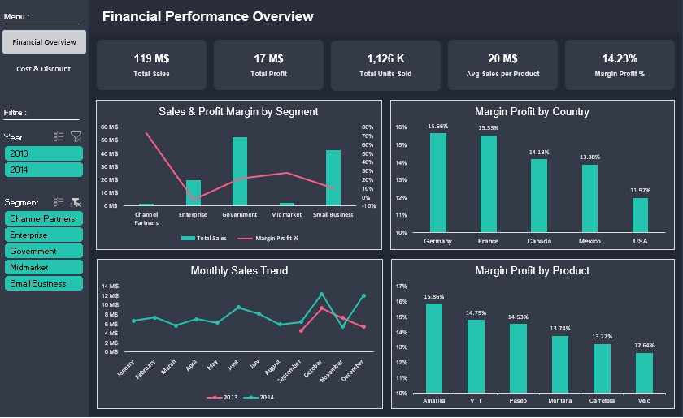
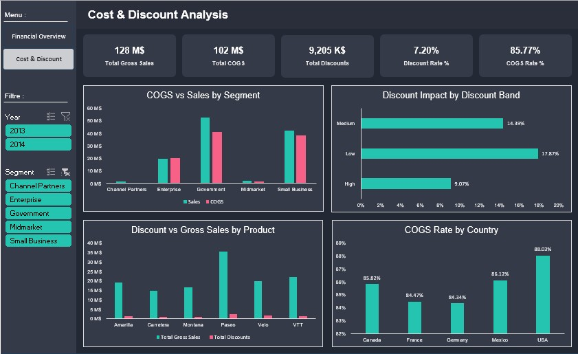

# Financial Performance & Cost Analysis (Excel Dashboard)

## Project Overview

This project analyzes financial performance using Excel and Power Query.  
The objective was to clean raw CSV data, build structured datasets, and develop an interactive financial dashboard using Pivot Tables and advanced Excel features.

## Business Objectives

1. Analyze total sales and profitability.
2. Evaluate margin performance across segments and countries.
3. Assess cost structure (COGS vs Sales).
4. Measure discount impact on profitability.
5. Identify cost efficiency opportunities.

## Project Workflow

1. Raw CSV data exploration
2. Data cleaning and transformation using Power Query
3. Data modeling within Excel (structured tables)
4. Creation of Pivot Tables and calculated fields
5. KPI design (Margin %, COGS Rate, Discount Rate)
6. Interactive dashboard design using slicers and charts

## Tools Used

- Microsoft Excel
- Power Query
- Pivot Tables
- Calculated Fields
- Slicers & Interactive Controls

## Dashboard Structure

### Financial Overview
- Total Sales
- Total Profit
- Units Sold
- Average Sales per Product
- Margin %

### Cost & Discount Analysis
- Total Gross Sales
- Total COGS
- Total Discounts
- Discount Rate
- COGS Rate

## Key Insights

- Government segment generates the highest revenue.
- USA shows the highest COGS rate, impacting margin.
- The Low discount band contributes the most to total discount impact.
- Margin performance varies significantly by product.

## Dashboard Preview

### Financial Overview

### Cost & Discount Analysis

## Skills Demonstrated

- Data transformation using Power Query
- Financial KPI calculation
- Cost structure analysis
- Profitability assessment
- Excel dashboard development
- Business storytelling with data

## Author

Mohamed Fakhri Ben Brahim
Aspiring Data Analyst | Python | SQL | Power BI | DAX | Advanced Excel
